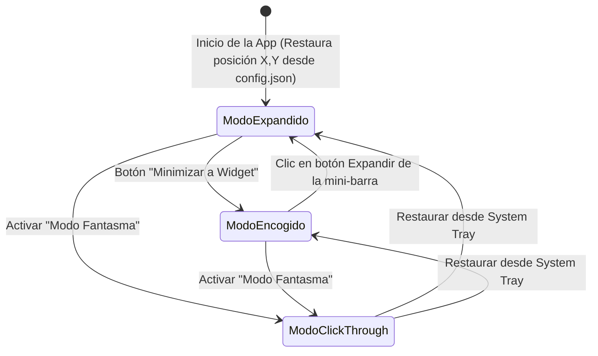
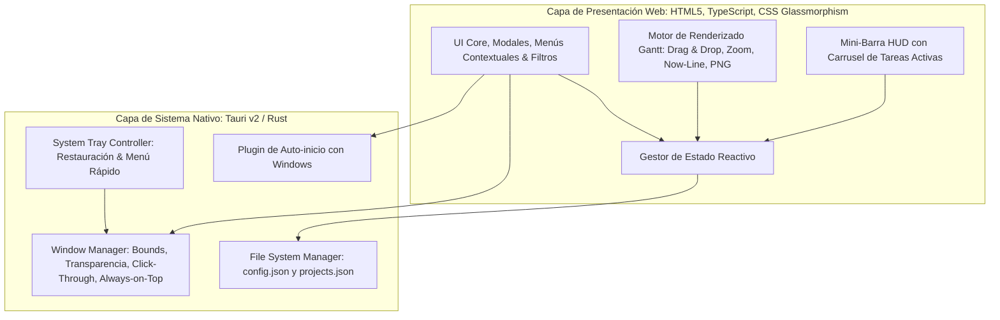

# Arquitectura y Requisitos: Floating Personal Gantt

Documento de especificación de requisitos, diseño conceptual y decisiones arquitectónicas para la aplicación de escritorio de programación de actividades con vista Gantt flotante.

---

## 1. Resumen Ejecutivo y Visión del Producto
- **Objetivo**: Proveer una herramienta de escritorio moderna, ultra-ligera y compacta para Windows que permita la planificación temporal de tareas a mediano plazo (días, semanas, meses) mediante un diagrama de Gantt interactivo, fluido y visualmente premium.
- **Diferencial clave**:
  - **Ventana Flotante (*Always-on-Top*)** con opacidad regulable y estética *Glassmorphism / Frosted Glass*.
  - **Modo Click-Through (Fantasma)**: La ventana ignora eventos del cursor para permitir interacción con el escritorio o aplicaciones de fondo; se gestiona/reactiva desde la **Bandeja del Sistema (System Tray)**.
  - **Auto-desvanecimiento por Inactividad**: Atenuación suave automática si no hay interacción del mouse tras un tiempo configurable.
  - **Modo Encogido (Mini-Widget HUD)**: Barra ultra-compacta con **carrusel** para navegar entre las tareas activas del día y sus días restantes.
  - **Doble Modo**: Vista expandida (tablero Gantt completo con Drag & Drop, categorías y filtros) y Vista encogida (monitoreo minimalista).
  - **Gestión Multi-proyecto**: Cambio rápido entre múltiples proyectos independientes.
  - **Persistencia Desacoplada (Configuración vs Datos)**: Archivos JSON separados para configuraciones del sistema (`config.json`) y datos de proyectos (`projects.json`).
  - **Exportación**: Respaldo en JSON y exportación visual del Gantt a imagen PNG.
  - **Persistencia de Posición y Estado**: Recuerda coordenadas de pantalla (X, Y), dimensiones, nivel de zoom y último modo activo.
  - **Arranque con el Sistema**: Opción para iniciar automáticamente al encender Windows.
  - **Stack de Alto Rendimiento**: **Tauri v2 + WebView2** (bajo consumo de memoria: ~25-40 MB RAM, binario <10 MB, renderizado acelerado por hardware).

---

## 2. Matriz Completa de Requisitos y Comportamientos

| Área | Característica | Estado | Detalle / Especificación de Comportamiento |
| :--- | :--- | :--- | :--- |
| **Ventana Flotante** | Always on Top | **Aprobado** | Conmutable desde la barra de herramientas y menú de bandeja. |
| | Transparencia Dinámica | **Aprobado** | Control deslizante de opacidad (20% a 100%) con efecto translúcido/desenfoque. |
| | Modo Click-Through | **Aprobado** | Clics pasan a través; reactivación mediante System Tray. |
| | Ghost por Inactividad | **Aprobado** | Atenuación suave automática tras inactividad del mouse; se restablece al pasar el cursor encima. |
| | Modo Encogido (Widget) | **Aprobado** | Mini-barra con carrusel (`‹ 1/N ›`) para navegar tareas activas del día. |
| | Recordar Posición/Modo | **Aprobado** | Guarda coordenadas X, Y, ancho, alto y modo (expandido/widget) entre reinicios. |
| | Iniciar con Windows | **Aprobado** | Configuración para inicio automático con el sistema operativo. |
| | Temas y Estética | **Aprobado** | Estilo Glassmorphism / Frosted Glass moderno con selector Claro / Oscuro. |
| **Gantt & Tiempo** | Escalas de Tiempo | **Aprobado** | Conmutador de escalas: Días, Semanas y Meses. |
| | Zoom Fluido | **Aprobado** | Zoom horizontal mediante `Ctrl + Scroll` y botones `+` / `-`. |
| | Marcador "Now" | **Aprobado** | Línea vertical destacada/animada sobre la fecha actual. |
| | Botón "Hoy" | **Aprobado** | Botón para centrar inmediatamente la vista en la fecha actual. |
| | Fines de Semana | **Aprobado** | Sombreado visual sutil en sábados y domingos para diferenciar días no laborables. |
| **Tareas & Estados** | Edición Drag & Drop | **Aprobado** | Arrastrar para mover fechas y estirar extremos laterales para ajustar duración. |
| | Creación de Tareas | **Aprobado** | Botón `+ Nueva Tarea` y modal emergente por doble clic en el calendario. |
| | Estados de Tarea | **Aprobado** | **Pendiente** (borde punteado), **En curso** (pulso sutil), **Finalizada** (texto tachado y opacidad atenuada). |
| | Alerta Tareas Vencidas | **Aprobado** | Resaltado en **rojo sutil pulsante** si la tarea superó la fecha actual y no está finalizada. |
| | Menú Contextual | **Aprobado** | Clic derecho sobre tarea: cambiar estado, color, duplicar o eliminar. |
| **Datos & Proyectos** | Campos de Tarea | **Aprobado** | `id`, `title`, `startDate`, `endDate`, `categoryId`, `status`. |
| | Categorías y Filtros | **Aprobado** | Categorías personalizables con color y buscador/filtro en tiempo real. |
| | Proyectos | **Aprobado** | Soporte para múltiples proyectos independientes. |
| | Persistencia Desacoplada | **Aprobado** | `config.json` para preferencias de entorno y `projects.json` para contenido de proyectos. |
| | Exportación | **Aprobado** | Respaldo/restauración en JSON y exportar vista a imagen PNG. |
| **Plataforma & Stack**| Entorno y Motor | **Aprobado** | Windows 10/11 con **Tauri v2 (Rust backend) + WebView2 + Vanilla CSS / TypeScript**. |

---

## 3. Diagrama de Estados de la Ventana y Flujo de Usuario



---

## 4. Esquema del Modelo de Datos (Separación Desacoplada)

Los datos se dividen en dos archivos dentro del directorio de datos de la aplicación (`%APPDATA%/floating-personal-gantt/` o carpeta local del proyecto):

### 4.1. Archivo de Configuración de la App: `config.json`
Almacena exclusivamente el estado de la ventana, preferencias de interfaz y opciones de comportamiento:

```json
{
  "version": "1.0",
  "activeProjectId": "proj-01",
  "theme": "dark",
  "opacity": 0.9,
  "alwaysOnTop": true,
  "launchOnStartup": false,
  "ghostOnInactivity": true,
  "inactivityTimeoutSeconds": 5,
  "highlightWeekends": true,
  "timeScale": "days",
  "compactMode": false,
  "windowBounds": {
    "x": 120,
    "y": 80,
    "width": 900,
    "height": 550
  }
}
```

### 4.2. Archivo de Datos de Proyectos y Tareas: `projects.json`
Almacena el contenido de los proyectos, categorías asociadas y la lista de tareas. Es independiente de la configuración y fácil de respaldar o compartir:

```json
{
  "version": "1.0",
  "projects": [
    {
      "id": "proj-01",
      "name": "Lanzamiento Producto X",
      "createdAt": "2026-08-10T10:00:00Z",
      "categories": [
        { "id": "cat-1", "name": "Desarrollo", "color": "#3B82F6" },
        { "id": "cat-2", "name": "Diseño", "color": "#10B981" },
        { "id": "cat-3", "name": "Marketing", "color": "#F59E0B" }
      ],
      "tasks": [
        {
          "id": "tsk-101",
          "title": "Diseño de Interfaz",
          "categoryId": "cat-2",
          "startDate": "2026-08-10",
          "endDate": "2026-08-18",
          "status": "completed"
        },
        {
          "id": "tsk-102",
          "title": "Implementación Frontend",
          "categoryId": "cat-1",
          "startDate": "2026-08-15",
          "endDate": "2026-08-28",
          "status": "in_progress"
        },
        {
          "id": "tsk-103",
          "title": "Campaña de Anuncios",
          "categoryId": "cat-3",
          "startDate": "2026-08-01",
          "endDate": "2026-08-10",
          "status": "pending"
        }
      ]
    },
    {
      "id": "proj-02",
      "name": "Mantenimiento Servidores",
      "createdAt": "2026-08-12T14:30:00Z",
      "categories": [
        { "id": "cat-4", "name": "Infraestructura", "color": "#8B5CF6" }
      ],
      "tasks": [
        {
          "id": "tsk-201",
          "title": "Actualización de Seguridad",
          "categoryId": "cat-4",
          "startDate": "2026-08-20",
          "endDate": "2026-08-22",
          "status": "pending"
        }
      ]
    }
  ]
}
```

---

## 5. Arquitectura del Sistema (Tauri v2 + WebView2)



---

## 6. Registro de Decisiones de Arquitectura (ADR)
* **ADR-001: Separación Desacoplada de Persistencia (`config.json` vs `projects.json`)**:
  - `config.json`: Maneja posición en pantalla, opacidad, tema, escala y preferencias del sistema.
  - `projects.json`: Maneja los datos de los proyectos, categorías y tareas de forma portable.
* **ADR-002: Mini-Barra Inteligente con Carrusel**: Visualización compacta que permite ciclar entre las tareas concurrentes del día actual.
* **ADR-003: Control de Ventana Nativa con Tauri v2**:
  - `window.set_always_on_top(true)`
  - `window.set_ignore_cursor_events(true)` para modo Click-Through.
  - `window.set_decorations(false)` para diseño sin marco nativo con bordes estilizados por CSS.
* **ADR-004: Reactivación vía System Tray**: Permite que el usuario devuelva la interactividad a la app cuando los clics del ratón están pasando a través de la ventana.
* **ADR-005: Motor de Estados Visuales de Tareas**:
  - `pending`: Borde punteado.
  - `in_progress`: Animación de pulso sutil continuo.
  - `completed`: Texto tachado con opacidad al 50%.
  - `overdue` (vencida no finalizada): Resaltado rojo sutil pulsante.
* **ADR-006: Inicio con Windows y Auto-desvanecimiento**: Gestión a través del plugin oficial de autostart de Tauri y temporizador en frontend para atenuación de opacidad por inactividad.
