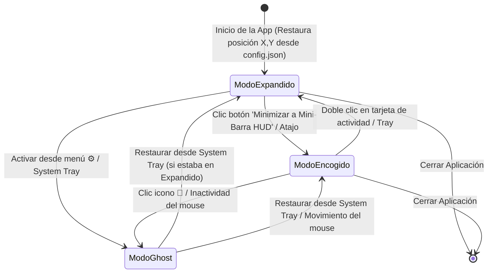

# Arquitectura y Requisitos: Floating Personal Gantt

Documento de especificación de requisitos, diseño conceptual y decisiones arquitectónicas para la aplicación de escritorio de programación de actividades con vista Gantt flotante.

---

## 1. Resumen Ejecutivo y Visión del Producto
- **Objetivo**: Proveer una herramienta de escritorio moderna, ultra-ligera y compacta para Windows que permita la planificación temporal de tareas a mediano plazo (días, semanas, meses) mediante un diagrama de Gantt interactivo, fluido y visualmente premium.
- **Diferencial clave**:
  - **Ventana Flotante (*Always-on-Top*)** con opacidad regulable y estética *Glassmorphism / Frosted Glass*.
  - **Modo Click-Through (Fantasma)**: La ventana ignora eventos del cursor para permitir interacción con el escritorio o aplicaciones de fondo; se gestiona/reactiva desde la **Bandeja del Sistema (System Tray)**.
  - **Auto-desvanecimiento por Inactividad**: Atenuación suave automática si no hay interacción del mouse tras un tiempo configurable en minutos (por defecto 2 minutos).
  - **Modo Encogido (Mini-Widget HUD)**: Barra ultra-compacta con **carrusel** para navegar entre todas las tareas activas y sus días restantes, y selector de proyectos con modal overlay integrado.
  - **Doble Modo**: Vista expandida (tablero Gantt completo con Drag & Drop, gestión de grupos, categorías y filtros) y Vista encogida (monitoreo minimalista).
  - **Gestión Multi-proyecto**: Creación limpia, renombrado y eliminación interactiva entre múltiples proyectos independientes.
  - **Persistencia Desacoplada (Configuración vs Datos)**: Archivos JSON separados para configuraciones del sistema (`config.json`) y datos de proyectos (`projects.json`) en `%APPDATA%/floating-personal-gantt/`.
  - **Exportación**: Respaldo en JSON y exportación visual del Gantt a imagen PNG.
  - **Persistencia de Posición y Estado**: Recuerda coordenadas de pantalla desacopladas (X, Y para ventana normal vs mini), dimensiones, nivel de zoom y último modo activo.
  - **Arranque con el Sistema**: Opción para iniciar automáticamente al encender Windows.
  - **Stack de Alto Rendimiento**: **Electron v34 + TypeScript + Vite + Vanilla CSS** (renderizado fluido a 60 FPS acelerado por hardware).

---

## 2. Matriz Completa de Requisitos y Comportamientos

| Área | Característica | Estado | Detalle / Especificación de Comportamiento |
| :--- | :--- | :--- | :--- |
| **Ventana Flotante** | Always on Top | **Aprobado** | Conmutable desde la barra de herramientas y menú de bandeja (exclusivo de modo mini). |
| | Transparencia Dinámica | **Aprobado** | Control deslizante de opacidad (5% a 100%) con efecto translúcido/desenfoque. |
| | Modo Click-Through | **Aprobado** | Clics pasan a través; reactivación mediante System Tray. |
| | Ghost por Inactividad | **Aprobado** | Atenuación suave automática tras inactividad del mouse configurable en minutos. |
| | Modo Encogido (Widget) | **Aprobado** | Mini-barra con carrusel (`‹ 1/N ›`) para navegar todas las tareas activas y doble clic para expandir. |
| | Recordar Posición/Modo | **Aprobado** | Guarda coordenadas X, Y, ancho y alto desacopladas para cada modo. |
| | Iniciar con Windows | **Aprobado** | Configuración para inicio automático con el sistema operativo. |
| | Temas y Estética | **Aprobado** | Estilo Glassmorphism con selector Claro / Oscuro y scrollbars personalizados. |
| **Gantt & Tiempo** | Escalas de Tiempo | **Aprobado** | Conmutador de escalas: Días, Semanas y Meses. |
| | Zoom Fluido | **Aprobado** | Zoom horizontal mediante `Ctrl + Scroll`. |
| | Sincronización de Scroll | **Aprobado** | Scroll horizontal sincronizado a 60 FPS entre la cabecera de fechas y la cuadrícula inferior. |
| | Marcador "Now" | **Aprobado** | Línea vertical continua fluorescente sobre la fecha actual. |
| | Botón "Hoy" | **Aprobado** | Centra inmediatamente la vista en la fecha actual. |
| | Fines de Semana | **Aprobado** | Sombreado visual sutil en sábados y domingos para diferenciar días no laborables. |
| **Tareas & Grupos** | Edición Drag & Drop | **Aprobado** | Arrastrar para mover fechas y estirar extremos laterales para ajustar duración. |
| | Creación de Tareas | **Aprobado** | Modal interactivo con validación visual inline de errores sin bloqueo de teclado. |
| | Grupos / Fases | **Aprobado** | Renombrado con doble clic (`PromptModal`) y eliminación inteligente con `ConfirmModal`. |
| | Estados de Tarea | **Aprobado** | **Pendiente** (borde punteado), **En curso** (pulso sutil), **Finalizada** (texto tachado y opacidad atenuada). |
| | Alerta Tareas Vencidas | **Aprobado** | Resaltado en **rojo sutil pulsante** si la tarea superó la fecha actual y no está finalizada. |
| | Menú Contextual | **Aprobado** | Clic derecho sobre tarea: cambiar estado, duplicar o eliminar con `ConfirmModal`. |
| **Datos & Proyectos** | Gestión de Proyectos | **Aprobado** | Nuevo proyecto limpio sin grupos, renombrar y eliminar con validación. |
| | Categorías y Filtros | **Aprobado** | Categorías personalizables con color y buscador en tiempo real. |
| | Persistencia Desacoplada | **Aprobado** | `config.json` para preferencias y `projects.json` para proyectos/tareas. |
| | Exportación | **Aprobado** | Respaldo/restauración en JSON y exportar vista a imagen PNG. |
| **Plataforma & Stack**| Entorno y Motor | **Aprobado** | Windows 10/11 con **Electron v34 + TypeScript + Vite + Vanilla CSS**. |

---

## 3. Diagrama de Estados de la Ventana y Flujo de Usuario



---

## 4. Estructura de Datos y Modelos (Schema)

```typescript
// Preferencias y Estado de Ventana (config.json)
export interface AppConfig {
  version?: string;
  theme: 'dark' | 'light';
  opacity: number;
  alwaysOnTop?: boolean;
  timeScale: 'days' | 'weeks' | 'months';
  compactMode: boolean;
  highlightWeekends?: boolean;
  windowBounds: { x: number; y: number; width: number; height: number };
  miniBounds?: { x: number; y: number };
  taskListWidth?: number;
  launchOnStartup?: boolean;
  ghostOnInactivity: boolean;
  inactivityTimeoutMinutes?: number;
  activeProjectId: string;
}

// Estructura de Proyectos y Tareas (projects.json)
export interface Task {
  id: string;
  title: string;
  categoryId?: string;
  groupId?: string;
  startDate: string;
  endDate: string;
  status: 'pending' | 'in_progress' | 'completed';
}

export interface TaskGroup {
  id: string;
  name: string;
  color?: string;
}

export interface Project {
  id: string;
  name: string;
  createdAt: string;
  groups: TaskGroup[];
  categories: Category[];
  tasks: Task[];
}
```

---

## 5. Registro de Decisiones de Arquitectura (ADR)

* **ADR-001: Separación Desacoplada de Persistencia (`config.json` vs `projects.json`)**:
  - `config.json`: Maneja posición en pantalla, opacidad, tema, escala y preferencias del sistema.
  - `projects.json`: Maneja los datos de los proyectos, categorías, grupos y tareas de forma portable.
* **ADR-002: Mini-Barra Inteligente con Carrusel Multi-Tarea**:
  - Visualización compacta que incluye todas las actividades no completadas del proyecto ordenadas por prioridad (en curso, activas hoy y futuras) con navegación `‹ 1/N ›`.
* **ADR-003: Control de Ventana Nativa con Electron**:
  - Preload seguro con `contextBridge` (`nodeIntegration: false`, `contextIsolation: true`).
  - `setAlwaysOnTop(true, 'floating')` exclusivo del modo mini.
  - `setIgnoreMouseEvents(true, { forward: false })` para modo Click-Through reactivado desde System Tray.
* **ADR-004: Modales Interactivos en Reemplazo de Diálogos Nativos Bloqueantes**:
  - `PromptModal` y `ConfirmModal` sustituyen completamente `window.prompt()` y `window.confirm()` para evitar pérdidas de foco y bloqueos de teclado en Electron.
* **ADR-005: Motor de Estados Visuales de Tareas**:
  - `pending`: Borde punteado.
  - `in_progress`: Animación de pulso sutil continuo.
  - `completed`: Texto tachado con opacidad al 50%.
  - `overdue`: Resaltado rojo sutil pulsante.
* **ADR-006: Sincronización de Scroll Horizontal en Tiempo Real**:
  - Enlace de eventos de desplazamiento entre cabecera de fechas y cuadrícula de actividades a 60 FPS con transformaciones de GPU.
